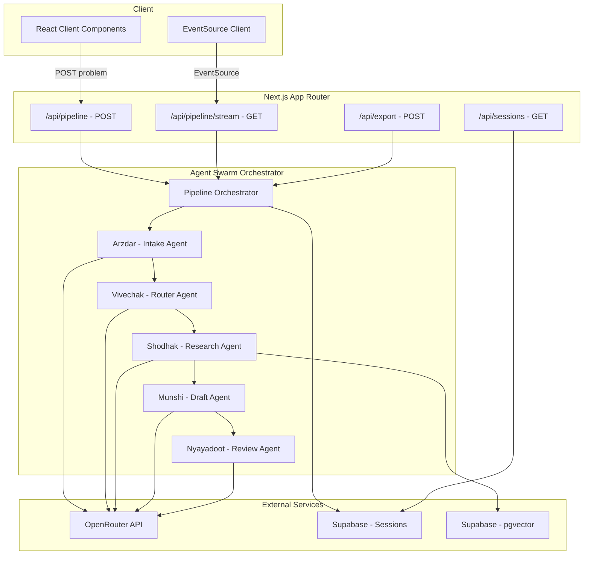
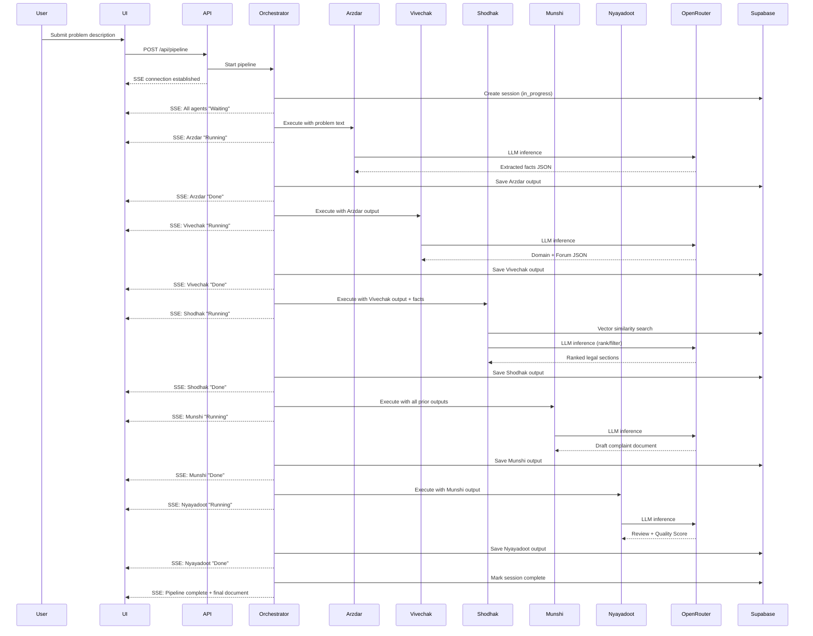
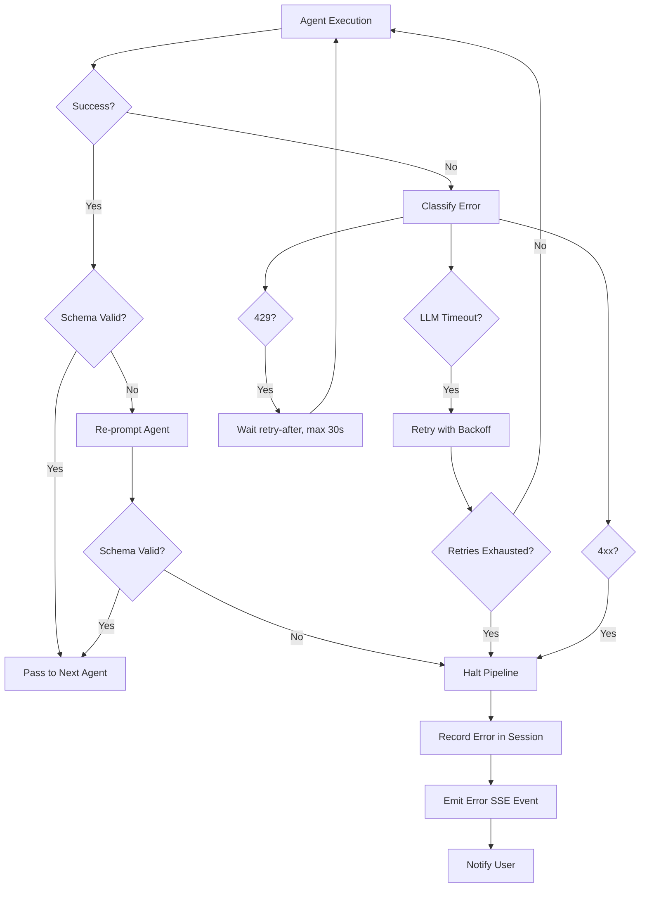

# Design Document: AI Vakeel

## Overview

AI Vakeel is an agent swarm system that orchestrates five specialized AI agents (Vakeel Panch) in a sequential pipeline to generate Indian legal complaint documents. The system accepts a user's natural language problem description (English or Hindi), routes it through domain classification, legal research, document drafting, and quality review stages, producing a formatted legal complaint ready for filing.

The architecture follows a pipeline pattern where each agent receives structured JSON input from its predecessor, performs its specialized task via LLM inference through OpenRouter API, and produces structured JSON output for the next agent. Real-time progress is streamed to the client via Server-Sent Events (SSE), and all session data is persisted in Supabase.

### Key Design Decisions

1. **Sequential Pipeline over Parallel Execution**: Agents execute in strict order because each depends on the previous agent's output. This simplifies error handling and ensures data consistency.
2. **SSE over WebSockets**: The data flow is unidirectional (server → client), making SSE the simpler and more appropriate choice. No bidirectional communication is needed during pipeline execution.
3. **OpenRouter as Unified LLM Gateway**: All agents use the same inference endpoint, enabling model switching without code changes and centralizing retry/rate-limit logic.
4. **Supabase for Dual Purpose**: pgvector for semantic search over legal texts, and standard tables for session persistence — single infrastructure dependency.
5. **Next.js App Router with Route Handlers**: API routes handle pipeline execution and SSE streaming; React Server Components handle session history; client components handle real-time UI updates.

## Architecture



### Pipeline Execution Flow



## Components and Interfaces

### 1. OpenRouter Client (`lib/openrouter-client.ts`)

Centralized HTTP client for all LLM inference requests.

```typescript
interface OpenRouterConfig {
  apiKey: string;
  model: string;
  maxInputTokens: number;  // 4096
  maxOutputTokens: number; // 4096
  timeoutMs: number;       // 60000
  maxRetries: number;      // 2
}

interface ChatMessage {
  role: 'system' | 'user' | 'assistant';
  content: string;
}

interface ChatCompletionRequest {
  model: string;
  messages: ChatMessage[];
  max_tokens: number;
  temperature?: number;
}

interface ChatCompletionResponse {
  id: string;
  choices: Array<{
    message: { role: string; content: string };
    finish_reason: string;
  }>;
  usage: { prompt_tokens: number; completion_tokens: number; total_tokens: number };
}

interface OpenRouterError {
  type: 'rate_limit' | 'client_error' | 'server_error' | 'timeout' | 'exhausted_retries';
  statusCode: number;
  message: string;
  attemptsUsed: number;
}

class OpenRouterClient {
  constructor(config: OpenRouterConfig);
  async chatCompletion(messages: ChatMessage[]): Promise<ChatCompletionResponse>;
  // Internal: handles retry with exponential backoff, rate-limit wait
}
```

### 2. Knowledge Base Client (`lib/knowledge-base.ts`)

Interface to Supabase pgvector for semantic search over legal texts.

```typescript
interface LegalChunk {
  id: string;
  content: string;
  embedding: number[];
  metadata: {
    actName: string;       // e.g., "Consumer Protection Act 2019"
    sectionNumber: string; // e.g., "Section 35"
    chapter: string;       // e.g., "Chapter IV"
  };
  similarityScore: number;
}

interface VectorSearchParams {
  queryEmbedding: number[];
  legalDomain: LegalDomain;
  similarityThreshold: number;
  maxResults: number; // max 20
}

interface VectorSearchResult {
  chunks: LegalChunk[];
  status: 'success' | 'no_matches' | 'search_error';
  error?: string;
}

class KnowledgeBaseClient {
  constructor(supabaseClient: SupabaseClient);
  async search(params: VectorSearchParams): Promise<VectorSearchResult>;
  async generateEmbedding(text: string): Promise<number[]>;
}
```

### 3. Agent Base Interface (`lib/agents/base-agent.ts`)

All five agents implement this interface.

```typescript
type AgentName = 'Arzdar' | 'Vivechak' | 'Shodhak' | 'Munshi' | 'Nyayadoot';
type AgentStatus = 'Waiting' | 'Running' | 'Done' | 'Error';

interface AgentExecutionResult<T> {
  success: boolean;
  output?: T;
  error?: {
    category: 'llm_timeout' | 'schema_validation' | 'unhandled_exception' | 'dependency_failure';
    description: string;
  };
  durationMs: number;
}

interface BaseAgent<TInput, TOutput> {
  name: AgentName;
  systemPrompt: string;
  outputSchema: JSONSchema;
  execute(input: TInput): Promise<AgentExecutionResult<TOutput>>;
  validateOutput(raw: unknown): TOutput | null;
}
```

### 4. Agent Implementations

#### Arzdar (Intake Agent) - `lib/agents/arzdar.ts`

```typescript
interface ArzdarInput {
  problemDescription: string;
  followUpResponses?: string[]; // responses to clarifying questions
}

interface ArzdarOutput {
  complainantName: string | 'not provided';
  respondentName: string | 'not provided';
  incidentDates: string[] | 'not provided';
  grievanceSummary: string | 'not provided';
  reliefSought: string | 'not provided';
  originalLanguage: 'en' | 'hi';
  followUpQuestions?: string[]; // max 3
  extractionComplete: boolean;
}
```

#### Vivechak (Router Agent) - `lib/agents/vivechak.ts`

```typescript
type LegalDomain = 'consumer_protection_2019' | 'rera_2016' | 'rti_2005';

interface VivechakInput {
  extractedFacts: ArzdarOutput;
}

interface VivechakOutput {
  legalDomain: LegalDomain;
  forum: string;
  confidenceScore: number; // 0.0 to 1.0
  requiresUserConfirmation: boolean; // true if confidence < 0.5
  reasoning: string;
}
```

#### Shodhak (Research Agent) - `lib/agents/shodhak.ts`

```typescript
interface ShodhakInput {
  extractedFacts: ArzdarOutput;
  legalDomain: LegalDomain;
}

interface ShodhakOutput {
  legalSections: Array<{
    content: string;
    actName: string;
    sectionNumber: string;
    chapter: string;
    similarityScore: number;
  }>;
  searchMetadata: {
    thresholdUsed: number;
    totalResultsFound: number;
  };
}
```

#### Munshi (Draft Agent) - `lib/agents/munshi.ts`

```typescript
interface MunshiInput {
  extractedFacts: ArzdarOutput;
  routing: VivechakOutput;
  legalSections: ShodhakOutput;
}

interface MunshiOutput {
  complaintDocument: string; // Markdown formatted
  documentStructure: {
    header: string;
    factsOfCase: string;
    legalGrounds: string;
    prayerClause: string;
    verification: string;
    hindiPrayerClause?: string; // if original language was Hindi
  };
}
```

#### Nyayadoot (Review Agent) - `lib/agents/nyayadoot.ts`

```typescript
interface NyayadootInput {
  complaintDocument: string;
  legalDomain: LegalDomain;
  extractedFacts: ArzdarOutput;
}

interface NyayadootOutput {
  qualityScore: number; // 0-100
  approvalStatus: 'approved' | 'needs_revision';
  issues: Array<{
    section: string;
    deficiencyType: 'missing_element' | 'incorrect_reference' | 'formatting_error' | 'factual_inconsistency';
    description: string;
    suggestedCorrection: string;
  }>; // max 10 items, empty if approved
  finalDocument: string;
}
```

### 5. Pipeline Orchestrator (`lib/orchestrator.ts`)

```typescript
interface PipelineConfig {
  maxExecutionTimeMs: number; // 300000 (5 minutes)
  sessionId: string;
}

interface PipelineEvent {
  type: 'status_update' | 'agent_output' | 'pipeline_complete' | 'pipeline_error' | 'timeout';
  agentName?: AgentName;
  status?: AgentStatus;
  summary?: string; // max 200 chars
  timestamp: string; // ISO 8601
  data?: unknown;
}

class PipelineOrchestrator {
  constructor(config: PipelineConfig, agents: BaseAgent[], sseEmitter: SSEEmitter);
  async execute(problemDescription: string): Promise<NyayadootOutput>;
  // Internal: validates inter-agent JSON, records timing, handles errors
}
```

### 6. SSE Stream Handler (`lib/sse-emitter.ts`)

```typescript
interface SSEEmitter {
  emit(event: PipelineEvent): void;
  close(): void;
  isConnected(): boolean;
}

// Implemented as a TransformStream in the Next.js Route Handler
// Uses ReadableStream with TextEncoder for SSE format
```

### 7. Session Manager (`lib/session-manager.ts`)

```typescript
interface Session {
  id: string;          // UUID
  createdAt: string;   // ISO 8601 UTC
  status: 'in_progress' | 'completed' | 'failed';
  problemDescription: string;
  agentOutputs: {
    arzdar?: ArzdarOutput;
    vivechak?: VivechakOutput;
    shodhak?: ShodhakOutput;
    munshi?: MunshiOutput;
    nyayadoot?: NyayadootOutput;
  };
  error?: {
    failingAgent: AgentName;
    category: string;
    description: string;
  };
  timing: {
    [key in AgentName]?: { startMs: number; endMs: number; durationMs: number };
  };
}

class SessionManager {
  constructor(supabaseClient: SupabaseClient);
  async create(problemDescription: string): Promise<Session>;
  async updateAgentOutput(sessionId: string, agentName: AgentName, output: unknown): Promise<void>;
  async markComplete(sessionId: string): Promise<void>;
  async markFailed(sessionId: string, error: Session['error']): Promise<void>;
  async getById(sessionId: string): Promise<Session | null>;
  async list(page: number, pageSize: number): Promise<{ sessions: Session[]; total: number }>;
}
```

### 8. API Route Handlers

```typescript
// app/api/pipeline/route.ts - POST
// Initiates pipeline execution, returns session ID

// app/api/pipeline/stream/route.ts - GET
// SSE endpoint, streams PipelineEvents for a given session ID

// app/api/sessions/route.ts - GET
// Lists sessions with pagination (page, pageSize query params)

// app/api/sessions/[id]/route.ts - GET
// Returns a single session with all agent outputs

// app/api/export/route.ts - POST
// Generates PDF from final document, returns file buffer
```

### 9. UI Components

```typescript
// components/ProblemInput.tsx - Text area with character count, submit button
// components/AgentPipeline.tsx - Container for agent cards
// components/AgentCard.tsx - Individual agent status + collapsible output
// components/DocumentViewer.tsx - Rendered final complaint document
// components/QualityBadge.tsx - Color-coded quality score display
// components/ExportButtons.tsx - Download PDF + Copy to clipboard
// components/SessionHistory.tsx - Paginated list of past sessions
// components/SessionDetail.tsx - Full session replay view
```

## Data Models

### Supabase Schema

```sql
-- Sessions table
CREATE TABLE sessions (
  id UUID PRIMARY KEY DEFAULT gen_random_uuid(),
  created_at TIMESTAMPTZ NOT NULL DEFAULT NOW(),
  status TEXT NOT NULL CHECK (status IN ('in_progress', 'completed', 'failed')),
  problem_description TEXT NOT NULL,
  original_language TEXT NOT NULL CHECK (original_language IN ('en', 'hi')),
  agent_outputs JSONB NOT NULL DEFAULT '{}',
  error JSONB,
  timing JSONB NOT NULL DEFAULT '{}',
  final_document TEXT,
  quality_score INTEGER CHECK (quality_score >= 0 AND quality_score <= 100)
);

CREATE INDEX idx_sessions_created_at ON sessions(created_at DESC);
CREATE INDEX idx_sessions_status ON sessions(status);

-- Legal knowledge base (pgvector)
CREATE EXTENSION IF NOT EXISTS vector;

CREATE TABLE legal_chunks (
  id UUID PRIMARY KEY DEFAULT gen_random_uuid(),
  content TEXT NOT NULL,
  embedding vector(1536),  -- OpenAI text-embedding-3-small dimension
  act_name TEXT NOT NULL,
  section_number TEXT NOT NULL,
  chapter TEXT NOT NULL,
  token_count INTEGER NOT NULL CHECK (token_count >= 200 AND token_count <= 1000),
  created_at TIMESTAMPTZ NOT NULL DEFAULT NOW()
);

CREATE INDEX idx_legal_chunks_embedding ON legal_chunks
  USING ivfflat (embedding vector_cosine_ops) WITH (lists = 100);

CREATE INDEX idx_legal_chunks_act ON legal_chunks(act_name);

-- Vector similarity search function
CREATE OR REPLACE FUNCTION match_legal_chunks(
  query_embedding vector(1536),
  match_threshold float,
  match_count int,
  filter_act_name text DEFAULT NULL
)
RETURNS TABLE (
  id UUID,
  content TEXT,
  act_name TEXT,
  section_number TEXT,
  chapter TEXT,
  similarity float
)
LANGUAGE plpgsql
AS $$
BEGIN
  RETURN QUERY
  SELECT
    lc.id,
    lc.content,
    lc.act_name,
    lc.section_number,
    lc.chapter,
    1 - (lc.embedding <=> query_embedding) AS similarity
  FROM legal_chunks lc
  WHERE
    (filter_act_name IS NULL OR lc.act_name = filter_act_name)
    AND 1 - (lc.embedding <=> query_embedding) > match_threshold
  ORDER BY lc.embedding <=> query_embedding
  LIMIT match_count;
END;
$$;
```

### Agent Output JSON Schemas

Each agent's output is validated against a JSON schema before being passed to the next agent. The schemas enforce the structure defined in the Components section above. Schema validation uses `zod` for runtime type checking in TypeScript.

```typescript
// lib/schemas/arzdar-schema.ts
import { z } from 'zod';

export const ArzdarOutputSchema = z.object({
  complainantName: z.union([z.string().min(1), z.literal('not provided')]),
  respondentName: z.union([z.string().min(1), z.literal('not provided')]),
  incidentDates: z.union([z.array(z.string()), z.literal('not provided')]),
  grievanceSummary: z.union([z.string().min(1), z.literal('not provided')]),
  reliefSought: z.union([z.string().min(1), z.literal('not provided')]),
  originalLanguage: z.enum(['en', 'hi']),
  followUpQuestions: z.array(z.string()).max(3).optional(),
  extractionComplete: z.boolean(),
});

// Similar schemas for Vivechak, Shodhak, Munshi, Nyayadoot outputs
```

### Environment Configuration

```typescript
// lib/config.ts
interface AppConfig {
  openRouter: {
    apiKey: string;          // OPENROUTER_API_KEY
    model: string;           // OPENROUTER_MODEL (e.g., "anthropic/claude-3.5-sonnet")
    maxInputTokens: 4096;
    maxOutputTokens: 4096;
    timeoutMs: 60000;
    maxRetries: 2;
  };
  supabase: {
    url: string;             // NEXT_PUBLIC_SUPABASE_URL
    anonKey: string;         // NEXT_PUBLIC_SUPABASE_ANON_KEY
    serviceRoleKey: string;  // SUPABASE_SERVICE_ROLE_KEY
  };
  pipeline: {
    maxExecutionTimeMs: 300000; // 5 minutes
  };
}
```

## Correctness Properties

*A property is a characteristic or behavior that should hold true across all valid executions of a system — essentially, a formal statement about what the system should do. Properties serve as the bridge between human-readable specifications and machine-verifiable correctness guarantees.*

### Property 1: Arzdar output schema completeness

*For any* valid problem description (between 50 and 5000 characters, in English or Hindi), the Arzdar agent's output SHALL contain all required fields (complainantName, respondentName, incidentDates, grievanceSummary, reliefSought, originalLanguage) with each field being either a valid extracted value or the literal string "not provided".

**Validates: Requirements 1.1, 1.2**

### Property 2: Follow-up question bound

*For any* problem description that lacks essential facts, the Arzdar agent SHALL generate at most 3 follow-up questions. The followUpQuestions array length SHALL never exceed 3 regardless of how many facts are missing.

**Validates: Requirements 1.3, 1.4**

### Property 3: Input length validation

*For any* string of length less than 50 characters or greater than 5000 characters, the Arzdar agent SHALL reject the input. *For any* string of length between 50 and 5000 characters (inclusive), the Arzdar agent SHALL accept the input for processing.

**Validates: Requirements 1.6**

### Property 4: Domain classification output invariants

*For any* valid ArzdarOutput, the Vivechak agent SHALL produce exactly one legalDomain from the set {consumer_protection_2019, rera_2016, rti_2005} and a confidenceScore in the range [0.0, 1.0].

**Validates: Requirements 2.1**

### Property 5: Consumer Protection forum selection by compensation value

*For any* case classified under Consumer Protection Act 2019 with a determinable compensation value, the forum SHALL be: District Forum if value ≤ ₹1 crore, State Commission if value > ₹1 crore and ≤ ₹10 crore, National Commission if value > ₹10 crore.

**Validates: Requirements 2.2**

### Property 6: Confidence threshold determines user confirmation

*For any* Vivechak output, requiresUserConfirmation SHALL be true if and only if confidenceScore < 0.5. When confidenceScore ≥ 0.5, the output SHALL proceed to the next agent without user intervention.

**Validates: Requirements 2.5, 2.6**

### Property 7: Shodhak result count bounds and threshold adaptation

*For any* vector search query, the Shodhak agent SHALL return between 3 and 10 legal sections. If fewer than 3 sections meet the 0.7 similarity threshold, the threshold SHALL be lowered in 0.05 decrements, and the final threshold used SHALL never be below 0.5.

**Validates: Requirements 3.2, 3.3**

### Property 8: Legal sections sorted by similarity descending

*For any* Shodhak output, the legalSections array SHALL be sorted by similarityScore in strictly non-increasing order.

**Validates: Requirements 3.4**

### Property 9: Munshi document contains all input facts

*For any* valid combination of ArzdarOutput, VivechakOutput, and ShodhakOutput, the Munshi-generated complaint document SHALL contain references to the complainant name, respondent name, forum name, and at least one legal section number from the input.

**Validates: Requirements 4.2**

### Property 10: Munshi document structural completeness

*For any* Munshi output, the documentStructure SHALL contain all required sections: header, factsOfCase, legalGrounds, prayerClause, and verification — each as non-empty strings.

**Validates: Requirements 4.3**

### Property 11: Hindi input produces Hindi prayer clause

*For any* input where originalLanguage is 'hi', the Munshi output SHALL include a non-empty hindiPrayerClause field. *For any* input where originalLanguage is 'en', the hindiPrayerClause field SHALL be absent or undefined.

**Validates: Requirements 4.8**

### Property 12: Quality score bounds and approval status consistency

*For any* Nyayadoot output, the qualityScore SHALL be in [0, 100]. When qualityScore ≥ 70, approvalStatus SHALL be 'approved' and issues SHALL be an empty array. When qualityScore < 70, approvalStatus SHALL be 'needs_revision' and issues SHALL contain between 1 and 10 items.

**Validates: Requirements 5.2, 5.3, 5.4**

### Property 13: Pipeline agent execution order

*For any* successfully completed pipeline session, the timing records SHALL show that each agent started after the previous agent ended: Arzdar.endMs ≤ Vivechak.startMs ≤ Vivechak.endMs ≤ Shodhak.startMs ≤ Shodhak.endMs ≤ Munshi.startMs ≤ Munshi.endMs ≤ Nyayadoot.startMs.

**Validates: Requirements 6.1, 6.4**

### Property 14: Inter-agent schema validation catches invalid output

*For any* agent output that does not conform to that agent's defined JSON schema, the pipeline orchestrator SHALL reject the output and not pass it to the next agent.

**Validates: Requirements 6.2**

### Property 15: SSE event summary length bound

*For any* agent completion SSE event, the summary field SHALL be at most 200 characters in length.

**Validates: Requirements 7.3**

### Property 16: Quality score color mapping

*For any* quality score value, the UI color coding SHALL be: green if score ≥ 70, yellow if score is between 50 and 69 (inclusive), red if score < 50.

**Validates: Requirements 9.5**

### Property 17: Session list pagination bound

*For any* page of session history results, the number of sessions returned SHALL be at most 20, and sessions SHALL be sorted by createdAt in descending order.

**Validates: Requirements 10.4, 10.6**

### Property 18: OpenRouter retry behavior for server errors

*For any* sequence of OpenRouter API 5xx responses or timeouts, the client SHALL retry at most 2 additional times with exponential backoff (1s, 2s delays). The total number of attempts SHALL never exceed 3.

**Validates: Requirements 11.3**

### Property 19: OpenRouter no-retry for client errors

*For any* OpenRouter API 4xx response (excluding 429), the client SHALL not retry and SHALL propagate the error immediately. The total number of attempts SHALL be exactly 1.

**Validates: Requirements 11.4**

### Property 20: OpenRouter rate limit wait capped at 30 seconds

*For any* OpenRouter API 429 response with a retry-after header value, the client SHALL wait for min(retry-after value, 30 seconds) before retrying.

**Validates: Requirements 11.7**

### Property 21: Knowledge Base search result bounds and sorting

*For any* similarity search query against the Knowledge_Base, the results SHALL contain at most 20 chunks, and SHALL be sorted by cosine similarity score in descending order.

**Validates: Requirements 12.2**

### Property 22: Knowledge Base error status distinction

*For any* Knowledge_Base search that returns no results or encounters an error, the result SHALL include a status field that distinguishes between "no_matches" (query succeeded but no results above threshold) and "search_error" (query failed).

**Validates: Requirements 12.5**

## Error Handling

### Error Categories

| Category | Source | Handling Strategy |
|----------|--------|-------------------|
| `llm_timeout` | OpenRouter API timeout after retries | Halt pipeline, record in session, notify user |
| `schema_validation` | Agent output fails JSON schema check | Re-prompt agent once, then halt if still invalid |
| `unhandled_exception` | Unexpected runtime error in agent | Halt pipeline, record stack trace, notify user |
| `dependency_failure` | Supabase/Knowledge_Base unavailable | Retry 2x, then halt with dependency error |
| `rate_limit` | OpenRouter 429 response | Wait per retry-after (max 30s), then retry |
| `client_error` | OpenRouter 4xx (not 429) | No retry, propagate immediately |
| `pipeline_timeout` | Total execution exceeds 5 minutes | Halt current agent, record timeout, notify user |
| `input_validation` | Problem description outside 50-5000 chars | Reject at API layer, return 400 |

### Error Flow



### Graceful Degradation

1. **Knowledge Base unavailable**: Shodhak retries 2x, then pipeline halts with clear error message indicating the legal research service is temporarily unavailable.
2. **Low confidence routing**: When Vivechak confidence < 0.5, the pipeline pauses for user confirmation rather than proceeding with uncertain classification.
3. **Missing facts after follow-ups**: Arzdar proceeds with available facts marked as "not provided" rather than blocking indefinitely.
4. **PDF export failure**: UI falls back to plain text download rather than showing only an error.

## Testing Strategy

### Property-Based Testing

**Library**: [fast-check](https://github.com/dubzzz/fast-check) (TypeScript property-based testing library)

**Configuration**:
- Minimum 100 iterations per property test
- Each test tagged with: `Feature: ai-vakeel, Property {number}: {property_text}`

**Properties to implement as PBT**:
- Properties 1-6: Agent input/output invariants (Arzdar, Vivechak)
- Properties 7-8: Shodhak search result invariants
- Properties 9-12: Munshi and Nyayadoot output invariants
- Properties 13-15: Pipeline orchestration invariants
- Properties 16-17: UI logic invariants (color mapping, pagination)
- Properties 18-22: OpenRouter client and Knowledge Base invariants

**Generators needed**:
- `arbitraryProblemDescription`: Random strings of 50-5000 chars in English/Hindi
- `arbitraryArzdarOutput`: Valid ArzdarOutput objects with random field values
- `arbitraryVivechakOutput`: Valid VivechakOutput with random domain/confidence
- `arbitraryShodhakOutput`: Valid legal sections with random similarity scores
- `arbitraryMunshiInput`: Combined valid inputs from prior agents
- `arbitraryNyayadootOutput`: Valid review outputs with random scores/issues
- `arbitraryHttpStatusCode`: Random 4xx/5xx codes for retry testing
- `arbitraryRetryAfterValue`: Random durations for rate limit testing
- `arbitrarySessionList`: Random session arrays for pagination testing

### Unit Tests (Example-Based)

- Domain-specific document formatting (Consumer Protection, RERA, RTI formats)
- Forum selection for RERA and RTI cases
- SSE event structure on pipeline start and error
- Session creation and state transitions
- UI component rendering (agent cards, document viewer, export buttons)
- Clipboard copy functionality
- Error display states

### Integration Tests

- Full pipeline execution with mocked OpenRouter (happy path)
- Pipeline timeout at 5 minutes
- Knowledge Base retry on failure
- SSE connection lifecycle (connect, stream events, close)
- Session persistence across agent completions
- PDF generation from complaint document
- OpenRouter request timing and retry delays

### End-to-End Tests

- User submits problem → receives complaint document
- User views session history and replays a past session
- Pipeline failure mid-execution → user sees error state
- Low confidence routing → user confirmation flow

